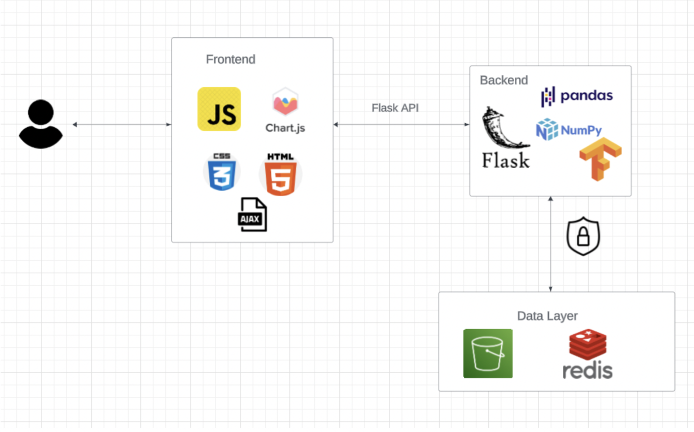

# RTCBlackWingsHack

## Table of Contents

- [Introduction](#introduction)
  - [Objective](#objective)
  - [Motivation](#motivation)
  - [Scope](#scope)
    - [Features](#features)
  - [Stakeholders](#stakeholders)
- [Dataset](#dataset)
- [Gap Analysis](#gap-analysis)
- [System Architecture](#system-architecture)
  - [Data Collection](#data-collection)
  - [Data Transformation and Storage](#data-transformation-and-storage)
- [Data Analysis & Visualization](#data-analysis--visualization)
- [Redis Caching](#redis-caching)
- [Installation](#installation)
- [Usage](#usage)

# Carbon Emissions Analytics Dashboard

## Introduction

### Objective

The primary objective of our project is to analyze daily carbon emissions originating from US domestic flights and the environmental impact associated with electricity, natural gas, and coal consumption. Our goal is to promote sustainability by advocating for practices like reducing non-essential travel, opting for eco-friendly travel options, and selecting renewable and environmentally responsible services.

### Motivation

Carbon emissions have consistently posed a significant threat to the environment, contributing to various issues like global warming, alterations in weather patterns, and rising average temperatures. Unfortunately, due to human negligence and a lack of sufficient attention to the matter, carbon emissions have become a pressing global concern. This issue urgently demands global attention. Through this project, our goal is to harness the capabilities of cloud computing services to analyze and mitigate carbon emissions associated with flights, electricity, and fossil fuels consumption. These factors collectively contribute to significant carbon footprints, and addressing them is crucial for environmental sustainability.

### Scope

The scope of this project includes building an interactive dashboard that allows users to perform comprehensive data analysis and study the long term adverse effects of carbon footprint on the environment and ecology through a causal inference of the data. Users can additionally educate themselves about the sustainability initiatives and green solutions for curbing these issues.

#### Features

The following features will be incorporated in the dashboard:
- Monitor and analyze carbon emissions associated with a broad range of emission generating activities in the modern world.
  - Aggregate the carbon footprint created by daily domestic flights running in the US through air traffic monitoring techniques and sophisticated methodologies to calculate greenhouse gas (CO2, Nitrogen Oxide, water vapors, etc.) emissions by considering factors such as distance traveled, number of passengers, cargo load, etc.
  - Compute the real-time aggregated carbon emissions based on the electricity consumption estimates of different US states.
- Understand the correlation between fuel usage (Coal, Natural Gas, Petroleum) and CO2 emissions associated with different sectors such as Commercial, Industrial, Residential, etc.
- NGO Interface
  - Build an interface to influence sustainable and environmentally responsible initiatives on a government and organizational level, and direct funds to the right cause.
  - This would educate the public on the ongoing climate change crisis through the massive amounts of carbon emissions being generated daily, and influence them to take sustainable actions on an individual/community level by collaborating with non-profit environmental organizations.

### Stakeholders

The following diverse group of stakeholders can utilize our dashboard analytics to lead innovative sustainability initiatives in their respective sectors:

- **Aviation Sector:** Major airlines, regional airports, and industry associations play pivotal roles in emissions reduction within the domestic flight domain. Our flight emissions analytics can aid them in inspecting frequent flight routes and incorporating green solutions and optimization strategies that can help curb the massive carbon footprint generated by the aviation industry.

- **Environmental Advocates:** Environmental organizations and advocates champion sustainability, influencing both aviation and digital sectors. They can use our dashboard to influence sustainable and environmentally responsible initiatives on a government and organizational level, and direct funds to the right cause.

- **Regulatory Bodies:** Government agencies and regulators oversee compliance with environmental standards in aviation and internet governance. They can be persuaded to make strong regulatory laws that promote sustainability within these sectors.

- **Consumers and Users:** Individuals and organizations, as end-users, impact emissions through choices in travel and energy consumption activities, making them pivotal stakeholders in sustainability advocacy.

## Dataset

We will be utilizing a wide range of datasets for the different components of our projects.

- **US Energy Information Administration (EIA):** We will be using the open-sourced EIA data to calculate and visualize CO2 emissions and carbon coefficients by different fuels (Coal, Natural Gas, Petroleum) and sectors (Residential, Industrial, Commercial) in US states.
  - [EIA CO2 Emissions Data](https://www.eia.gov/opendata/browser/co2-emissions/co2-emissions-aggregates)

- **US Environmental Protection Agency (EPA):** This dataset provides information about environmental activities that may affect air, water, and land anywhere in the United States. We will be mapping this information with carbon emissions and check if there is any correlation, and visualize the overall environmental impact.
  - [EPA Envirofacts Data Service API](https://www.epa.gov/enviro/envirofacts-data-service-api)

- **OpenSky Network API:** This open-source API helps retrieve live airspace information, which, in our case, can help in monitoring daily flight traffic information domestically in the United States. This information will subsequently be used to calculate daily carbon emissions generated by flights in the US.
  - [OpenSky Network API](https://openskynetwork.github.io/opensky-api/)


## Gap Analysis

At present, there is a lack of widespread awareness among individuals and organizations about the significant contributions of domestic flights, digital technologies, increasing coal and electricity to carbon emissions and climate change. There is also a lack of a centralized dashboard that documents and analyzes carbon emissions generated from different commercial/industrial/residential activities. Data related to it is dispersed making it difficult to analyze and evaluate. This project aims to bridge the existing gap by raising awareness and fostering a sense of responsibility among individuals and organizations, encouraging greener choices. The project seeks to create a cohesive and centralized platform for data integration, enabling comprehensive analysis of carbon emissions.

## System Architecture

### Data Collection

Data is collected from various third-party REST API sources. We will be focusing on flight monitoring data, fuel & sector emissions data, and CO2 emissions generated from electricity consumption. For the purposes of this project, the region for all the data components will be restricted to the USA. The detailed methodologies and data source links to extract data are listed below:

1. **Air Traffic Monitoring & Carbon Emissions Calculation**

   Data:
   - [OpenSky Network API - Arrivals by Airport](https://openskynetwork.github.io/opensky-api/rest.html#arrivals-by-airport)
   - [OpenSky Network API - Departures by Airport](https://openskynetwork.github.io/opensky-api/rest.html#departures-by-airport)
   - [ICAO Identifiers for US Airports](https://github.com/ip2location/ip2location-iata-icao/blob/master/iata-icao.csv)
   
   Process:
   - Monitor and calculate aggregated carbon emissions generated by daily flight departures in frequently visited US airports.
   - Fetch daily air traffic data with a delay of 1 day from the OpenSky Network API.
   - Build an adjacency graph of flights for monitoring current air traffic to avoid double-counting carbon emissions.
2. **CO2 Emissions Aggregate and CO2 Coefficients**

   Data:
   - [US Energy Information Administration (EIA) - CO2 Emissions Aggregates](https://www.eia.gov/opendata/browser/co2-emissions/co2-emissions-aggregates)
   - [US Energy Information Administration (EIA) - CO2 Emissions and Carbon Coefficients](https://www.eia.gov/opendata/browser/co2-emissions/co2-emissions-and-carbon-coefficients)

   Process:
   - Calculate CO2 emissions based on fuel, sector, and US states.
   - Predict future CO2 emissions in different states based on current consumption patterns.

## Data Transformation and Storage

The data from the API sources is extracted on lambda functions on a daily basis via Amazon EventBridge. Within these lambda functions, data cleaning, data manipulation, and data transformation are done to get the desired results. Furthermore, these calculations are stored in Amazon S3 in a JSON format. 

### Air Traffic Monitoring and Carbon Emission Calculation

  - Step 1: Retrieve Real-Time US Domestic Flights Information

      To monitor domestic flight departures in the US, we retrieve data from the Open Sky API on a daily basis. This data includes information such as the time of the last aircraft sighting, estimated arrival and departure airports, and potential airport candidates around the source and destination airports for emergency landings.
      
      **API Endpoint:**
      - [Open Sky API - Departures by Airport](https://opensky-network.org/api/flights/departure?airport=[ICAO identifier of airport]&begin=[begin_timestamp]&end=[end_timestamp])
      
      **Data Sources:**
      - [ICAO Identifiers for US Airports](https://github.com/ip2location/ip2location-iata-icao/blob/master/iata-icao.csv)
      - [List of the Busiest Airports in the United States](https://en.wikipedia.org/wiki/List_of_the_busiest_airports_in_the_United_States)
      
      **Example API Response:**
      ```json
      {
          "icao24": "ab6229",
          "firstSeen": 1698288392,
          "estDepartureAirport": "KORD",
          "lastSeen": 1698293889,
          "estArrivalAirport": "4OK1",
          "callsign": "SWA3973",
          "estDepartureAirportHorizDistance": 3334,
          "estDepartureAirportVertDistance": 138,
          "estArrivalAirportHorizDistance": 26396,
          "estArrivalAirportVertDistance": 11329,
          "departureAirportCandidatesCount": 521,
          "arrivalAirportCandidatesCount": 0
      }
      ```

 - Step 2: Calculate the Distance Between Source and Destination Airport
  The distance between source and destination airports, obtained from the API, is calculated using geographical coordinates. The result is in kilometers.
  
  ```python
  def calculate_distance(x1,y1,x2,y2):
      R = 6373.0
      lat1 = radians(x1)
      lon1 = radians(y1)
      lat2 = radians(x2)
      lon2 = radians(y2)
      
      dlon = lon2-lon1
      dlat = lat2-lat1
      
      a = sin(dlat / 2)**2 + cos(lat1) * cos(lat2) * sin(dlon/2)**2
      c = 2*atan2(sqrt(a),sqrt(1-a))
      
      return R*c
  ```

 - Step 3: Calculate the Fuel Consumption of Each Flight Journey

   In aviation, fuel consumption is a complex calculation involving factors such as fuel type, aircraft engine type, geographical conditions, aircraft dimensions, seating capacity, cruise speed, thrust, efficiency, etc. Due to limitations in obtaining specific aviation data, we'll assume a standard aircraft type for all flights, considering the Boeing 767-300ER.
    
  **Aircraft Specification: Boeing 767-300ER**
  
    | Aircraft Specification | Boeing 767-300ER       |
    |------------------------|------------------------|
    | Fuel Capacity          | 16,700–24,140 US gal   |
    | Thrust                 | 252–274 kN             |
    | Cruise Speed           | 850-900 kmph           |
    | Engine Type            | PW4000                 |
    

  
  **Thrust Specific Fuel Consumption (SFC)**
  
    To calculate fuel consumption, we use the concept of Thrust Specific Fuel Consumption (SFC), which is the amount of fuel consumed by an aircraft engine per unit time for a given thrust rating. The formula for SFC is:
    
    $$\[ SFC = \frac{Fuel Burn}{Thrust} \]$$
    
  For the PW4000 engine, the SFC is in the range of 9.9-10.2 g/kN s, as obtained from [Thrust-specific fuel consumption](https://en.wikipedia.org/wiki/Thrust-specific_fuel_consumption#Typical_values_of_SFC_for_thrust_engines).
  
  The average thrust of the aircraft during cruise time is in the range of 252-274 kN. This gives us fuel burn in units of g/s, which will be further converted to kg/hr.
  
  **Calculation Steps**
  
  1. **Calculate Fuel Burn (g/s):**
     $$Fuel Burn = SFC \times Thrust$$
  
  2. **Convert Fuel Burn to Kg/hr:**
     $$Fuel Burn_{kg/hr} = \left(\frac{Fuel Burn}{1000}\right) \times 3600$$
  
  3. **Calculate Time for the Journey:**
     $$Time = \frac{Distance}{Cruise Speed}$$
  
  4. **Calculate Total Fuel Consumption (Kg):**
     $$Total Fuel Consumption = Fuel Burn_{kg/hr} \times Time$$

  This methodology helps in estimating the total fuel consumption (in Kg) throughout the flight journey.

- Step 4: Calculate the CO2 emissions generated by each flight journey

  To calculate carbon emissions, we follow the methodology explained in the following source: [How to Calculate Flight Emissions](https://oncarbon.app/articles/how-you-calculate-flight-emissions)
  
  1. **Convert Fuel Burn to Emissions:**
     - Burning one kilogram of jet fuel produces 3.157 kg of carbon dioxide. This ratio is used to calculate CO2 emissions associated with the flight journey.
  
  2. **Add Emissions from Fuel Production:**
     - Fossil fuels cause emissions not only when burned but also during extraction, drilling, refining, and transportation. A constant of 0.617 kg of CO2 emissions per kilogram of jet fuel produced is used to calculate these emissions.
  
  The following code will be used to calculate the fuel consumption and carbon emissions of all flight journeys in the unit kg/hr.

  ```python
  def calculate_emissions(dist):
    sfc = 9.9
    thrust = 252
    
    #Thrust Specific fuel consumptions (TSFC) is fuel consumption (grams/second) per unit of thrust (newtons, or N)
    fuel_burn = sfc * thrust
    #Converting fuel burn from g/s to kg/hr
    fuel_burn_kg_hr = (fuel_burn/1000)*3600
    
    #Calculating time taken for the journey based on airplane's average cruise speed in km/hr
    cruise_speed = 900
    time = dist/cruise_speed
    
    total_fuel_burn = fuel_burn_kg_hr * time
    #Burning one kilogram of jet fuel produces 3.157 kg of carbon dioxide
    co2_emissions = total_fuel_burn * 3.157
    #Calculating the amount of CO2 emissions generated during fuel production
    fuel_production_emissions = total_fuel_burn * 0.617
    total_co2_emissions = co2_emissions + fuel_production_emissions
    
    return total_co2_emissions

  ```

### CO2 Aggregate Emission by Fuel and Sector in US States

For our third task, we will be obtaining data on carbon dioxide (CO2) emissions resulting from different fuels usage in various sectors. This data will be collected on a monthly basis. It will provide us with the total CO2 emissions, the specific time period during which these emissions occurred, and the sectors responsible for these emissions, along with the corresponding CO2 emission quantities.

- Step 1: Fetch the data from below API

API: [CO2 Emissions Aggregates API](https://api.eia.gov/v2/co2-emissions/co2-emissions-aggregates/data/?frequency=annual&data[0]=value&sort[0][column]=period&sort[0][direction]=desc&offset=0&length=5000)

### Sample API Response:

```json
{
    "period": 2021,
    "sectorId": "RC",
    "sector-name": "Residential carbon dioxide emissions",
    "fuelId": "PE",
    "fuel-name": "Petroleum",
    "stateId": "AL",
    "state-name": "Alabama",
    "value": 0.295148,
    "value-units": "million metric tons of CO2"
}
```
  The parameters of the API include:
  
  - Fuel type: Coal, Petroleum, Natural gas
  - Sector Type: Commercial, Industrial, Residential, Transportation
  - US State
    
- Step 2: Implement the Lambda Function

```python
  headers = {
    "X-Params": json.dumps({
        "frequency": "annual",
        "data": ["value"],
        "facets": {
            "sectorId": [
                "CC",
                "IC",
                "RC",
                "TT"
            ]
        },
        "start": 1970,
        "end": 2021,
        "sort": [{"column": "period", "direction": "desc"}],
        "length": 5000,
        "offset": 0
    }),
    "User-Agent": "Your User Agent Here",
    "Content-Type": "application/json"
}

while start_flag or len(emissions_data['response']['data']) > 0:
    start_flag = False
    response = requests.get(api_url, params=params, headers=headers)
    if response.status_code == 200:
        emissions_data = response.json()
        for doc in emissions_data['response']['data']:
            fuel_emissions.append(doc)
        counter += 5000
        headers = {
            "X-Params": json.dumps({
                "frequency": "annual",
                "data": ["value"],
                "facets": {
                    "sectorId": [
                        "CC",
                        "IC",
                        "RC",
                        "TT"
                    ]
                },
                "start": 1970,
                "end": 2021,
                "sort": [{"column": "period", "direction": "desc"}],
                "length": 5000,
                "offset": counter
            }),
            "User-Agent": "Your User Agent Here",
            "Content-Type": "application/json"
        }
    else:
        print("Failed to retrieve data. Status code:", response.status_code)
```  

## Data Analysis & Visualization
For analyzing the data, we have built an interactive dashboard with a flask backend. The architecture of our dashboard is shown below.




## Redis Caching

We have implemented Redis for caching the result calculations during daily runs, so that if the dashboard is run multiple times a day, the result will be extracted from the Redis Cache. 


## Installation

Provide instructions on how to install and set up the project here.

## Usage

Include information on how to use the dashboard and any additional configuration steps.


